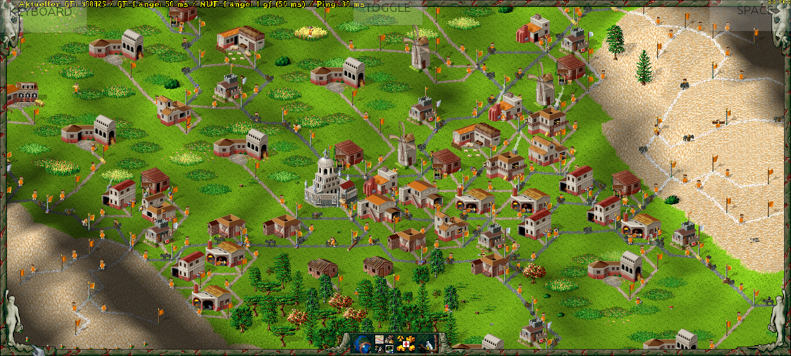
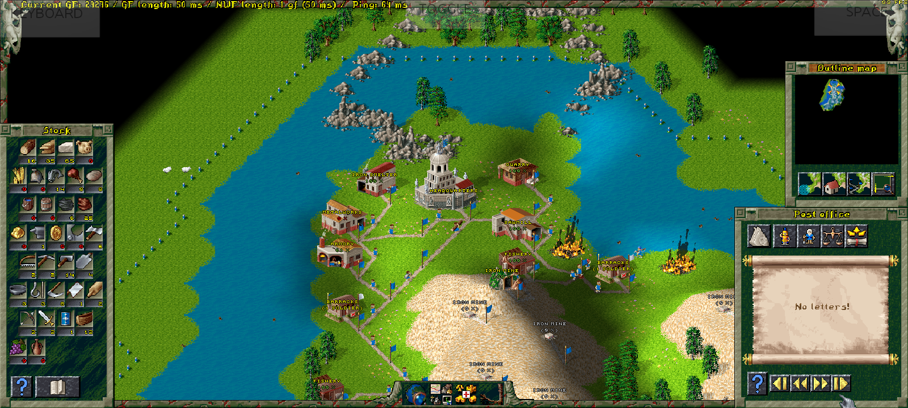
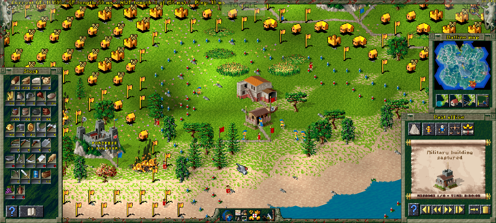
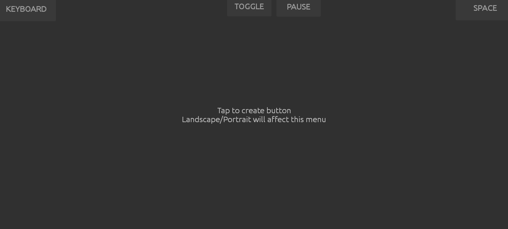
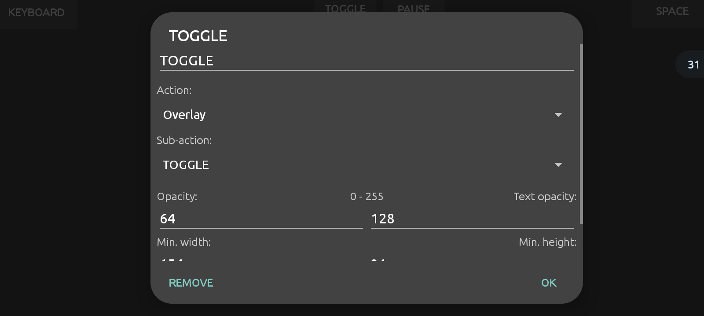
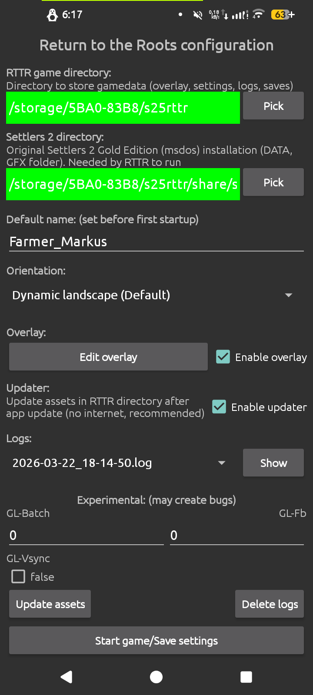
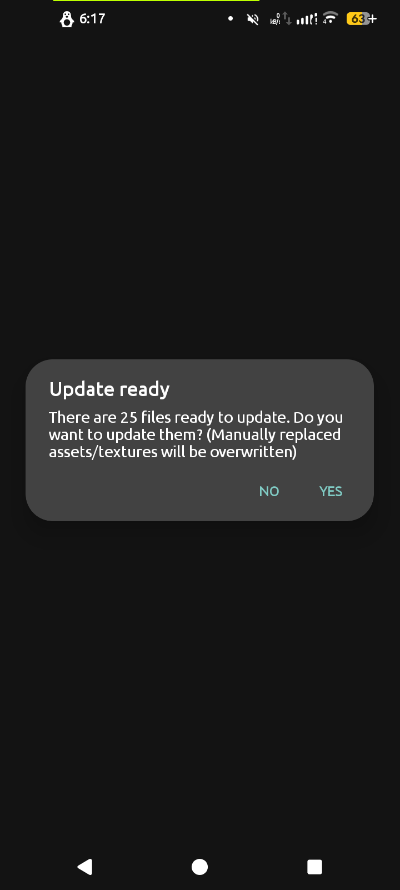

## Return to the Roots Android
Port of the fan-project [Return to the Roots](https://github.com/Return-To-The-Roots/s25client) to make The Settlers 2 and all of RttR's addons enjoyable on Android.  

This project is work in progress, please report bugs [here](https://github.com/Farmer-Markus/s25rttr-android/issues).  

Features:
- Touch controls (shortcut: double tap on window to close)
- Mouse works fine like on pc
- App config menu to create/choose folder, set default username, orientation and view/delete log files
- Detect app update & update game files
- Overlay to add/move around buttons to emulate keyboard, mouse and other events like opening the onscreen keyboard

Planned bugfixes:
- Working multiplayer
 

| | |
| - | - |
|  |  |

## Downloads
Download from [GitHub releases](https://github.com/Farmer-Markus/s25rttr-android/releases) or [build it yourself](#compiling) as described below.

## Compiling
You will need git  
Clone this repository and its submodules:

	git clone --recursive https://github.com/Farmer-Markus/s25rttr-android

When using android studio just open the project folder and click on build and everything should work fine.  
If you want to use the commandline see steps below.

### Dependencies
#### Linux
You need to install [gradle](https://gradle.org/) and java(for example [openjdk](openjdk.org))
Also you will need the android sdk, ndk, buildtools and android CMake.
These can be installed using the sdkmanager cmdline tool.

##### Archlinux
To install the required packages run:

	sudo pacman -S gradle jdk17-openjdk make gettext
To install the android sdkmanager you can use the [AUR package](https://aur.archlinux.org/packages/android-sdk-cmdline-tools-latest) or download the tools yourself on [Googles website](https://developer.android.com/studio?hl=de#command-tools).

##### Debian
To install the required packages run:

	sudo apt-get install gradle openjdk-17-jdk sdkmanager make gettext

##### Windows
coming soon...

### Installing android SDK/build-tools
To show every available package run:

	sdkmanager --list
You will need at least the following packages

	android sdk 34
	android cmake 3.22.1
	Platform-Tools v.35.0.2
	android build-tools 35.0.0
	android ndk 27.0.12077973
You can install them via the `sdkmanager --install` command:

	sdkmanager --install "platforms;android-34" "cmake;4.1.2" "platform-tools;36.0.2" "ndk;27.0.12077973" "build-tools;35.0.0"

This will install the SDK to a specific location. (Remember the location)  
You need to accept the licenses using the sdkmanager

	sdkmanager --licenses
You may want to move the SDK to another folder like ~/Android/Sdk (Default in android studio)

Now you need to give the Gradle script the path to the android sdk.  
You can create a `local.properties` file containing the following.  

	sdk.dir=<path to the sdk>
Or set the environment variable `ANDROID_HOME` to the sdk installation.

### Building
Now you should be able to run the build command.

	./gradlew.sh assembleDebug	# Debug build on linux
	./gradlew.bat assembleDebug	# Debug build on windows
To build the release version you need to look a bit deeper into the android apk signing system.

	./gradlew.sh assembleRelease	# Release build on Linux
	./gradlew.bat assembleRelease	# Release build on Windows

## Screenshots
| | |
| - | -|
|  |  |
|  |  |
|  |  |